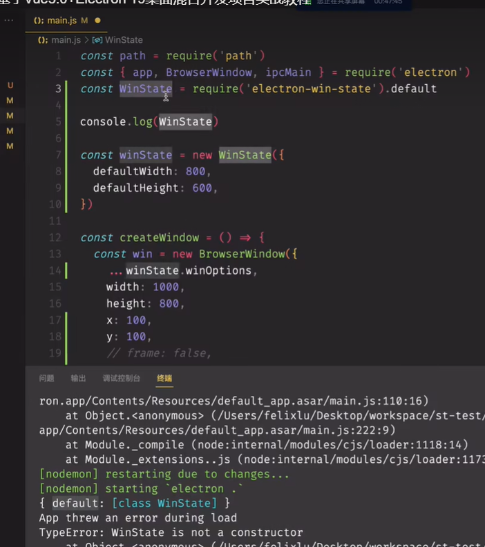

正常情况下，nodemon只能监听JS文件的变化，监听不到HTML,CSS这些的变化，       
通过 ` npx nodemon --help ` 来查看信息

学习到了electron-in-state 这个包的使用用法      
`npm i electron-window-state -S ` S参数表示只安装到生产环境里面

坑 ,因为别人使用es6的Import导入，而你使用的是require导入，这个时候就需要一个default     



使用用法
```JS
const path = require('path')
const { app, BrowserWindow } = require('electron')
// 引入包
const windowStateKeeper = require('electron-window-state')

const createWindow = () => {
  // 初始化窗口状态管理器
  let state = windowStateKeeper({
    defaultWidth: 800,  // 默认宽度
    defaultHeight: 600 // 默认高度
  })

  const win = new BrowserWindow({
    x: state.x,         // 使用上次的X坐标
    y: state.y,         // 使用上次的Y坐标
    width: state.width, // 使用上次的宽度
    height: state.height,// 使用上次的高度
    webPreferences: {
      preload: path.resolve(__dirname, './preload.js')
    }
  })

  // 绑定窗口状态自动保存
  state.manage(win)
  
  win.loadFile('index.html')
}
```

meta 里面的 img-src 'self'   的含义，类似的还有哪些 img-src *

context-menu : 右键上下文信息   
可以用它来实现右键弹出保存图片的功能

## 关于dialog的一些API的使用
显示用于打开和保存文件、警报等的本机系统对话框
```JS

const {app, BrowserWindow, dialog} = require('electron')

mainWindow.webContents.on('did-finish-load', () => {
  dialog.showOpenDialog({
    buttonLabel: '选择',
    defaultPath: app.getPath('desktop'),
    properties: ['multiSelections', 'createDirectory', 'openFile', 'openDirectory']
  }).then((result)=> {
    console.log(result.filepaths)
  })
}) 
// 一定要在主进程里面解构这个  dialog


showSaveDialog, 
showMessageBox
```


### 快捷键  globalShortcut
它也是主进程里面的一个模块
```JS


```

## 定义菜单  

```JS
const { app, BrowserWindow, Menu } = require('electron');

app.whenReady().then(() => {
  const mainWindow = new BrowserWindow({
    width: 800,
    height: 600,
  });

  mainWindow.loadFile('index.html');

  // 创建菜单
  const menu = Menu.buildFromTemplate([
    {
      label: 'File',
      submenu: [
        { label: 'New', accelerator: 'CmdOrCtrl+N', click: () => { console.log('New file') } },
        { label: 'Open', accelerator: 'CmdOrCtrl+O', click: () => { console.log('Open file') } },
        { type: 'separator' },
        { label: 'Exit', accelerator: 'CmdOrCtrl+Q', click: () => { app.quit() } }
      ]
    },
    {
      label: 'Edit',
      submenu: [
        { label: 'Undo', accelerator: 'CmdOrCtrl+Z', click: () => { console.log('Undo') } },
        { label: 'Redo', accelerator: 'Shift+CmdOrCtrl+Z', click: () => { console.log('Redo') } },
        { type: 'separator' },
        { label: 'Cut', accelerator: 'CmdOrCtrl+X', click: () => { console.log('Cut') } },
        { label: 'Copy', accelerator: 'CmdOrCtrl+C', click: () => { console.log('Copy') } },
        { label: 'Paste', accelerator: 'CmdOrCtrl+V', click: () => { console.log('Paste') } }
      ]
    }
  ]);

  // 应用菜单
  Menu.setApplicationMenu(menu);
});
```

总结    
Menu.buildFromTemplate：用于从模板数组创建菜单。    
Menu.setApplicationMenu：将菜单应用到应用。   
menu.popup：在特定位置显示弹出菜单。  
平台自定义：可以根据不同的操作系统自定义菜单。  
通过这些方法，你可以在 Electron 应用中创建和管理各种类型的菜单，提升用户体验。


主菜单与上下文菜单

## 托盘


### **1. 图片文件名中的 `@2x`**

`@2x` 是一种命名约定，用于表示高分辨率图片。它主要用于支持高像素密度的屏幕（如 Retina 显示屏）。以下是其含义：

- **普通分辨率图片**：`image.png`（适用于普通屏幕，像素密度为 `1x`）。
- **高分辨率图片**：`image@2x.png`（适用于高分辨率屏幕，像素密度为 `2x`）。

### **2. `devicePixelRatio` API**

`devicePixelRatio` 是浏览器提供的一个全局属性，用于获取设备的像素密度比值。它表示物理像素与 CSS 像素的比例。

#### **含义**
- **`devicePixelRatio`**：返回一个数值，表示设备的物理像素与 CSS 像素的比例。
  - **`1`**：普通屏幕（如大多数桌面显示器）。
  - **`2`**：高分辨率屏幕（如 Retina 显示屏）。
  - **其他值**：某些设备可能有其他值（如 `1.5`、`3` 等）。

#### **用途**
- 用于根据设备的像素密度加载不同分辨率的图片。
- 优化网页在高分辨率屏幕上的显示效果。

### **3. 不同浏览器和控制台的区别**

`devicePixelRatio` 是一个标准的浏览器 API，但在不同浏览器和设备上可能会有细微的差异。

#### **主流浏览器支持**
- **Chrome**、**Firefox**、**Safari**、**Edge** 等主流浏览器都支持 `devicePixelRatio`。
- 在大多数情况下，`devicePixelRatio` 的行为是一致的。

#### **控制台中的使用**
- 在浏览器控制台中，可以直接访问 `window.devicePixelRatio` 来查看当前设备的像素密度比值。

#### **示例代码**
```javascript
console.log(window.devicePixelRatio); // 输出设备的像素密度比值
```

### **4. 实际应用示例**

#### **根据 `devicePixelRatio` 加载不同分辨率的图片**
```javascript
const ratio = window.devicePixelRatio;
const img = new Image();

if (ratio >= 2) {
  img.src = 'image@2x.png'; // 高分辨率图片
} else {
  img.src = 'image.png'; // 普通分辨率图片
}

document.body.appendChild(img);
```

### **总结**
- **`@2x`**：表示高分辨率图片，用于支持高像素密度的屏幕。
- **`devicePixelRatio`**：获取设备的像素密度比值，用于优化图片加载和显示。
- **浏览器支持**：主流浏览器都支持 `devicePixelRatio`，行为基本一致。
- **控制台使用**：在浏览器控制台中可以直接访问 `window.devicePixelRatio`。

通过这些知识，你可以确保应用在不同设备上都能提供最佳的显示效果。


