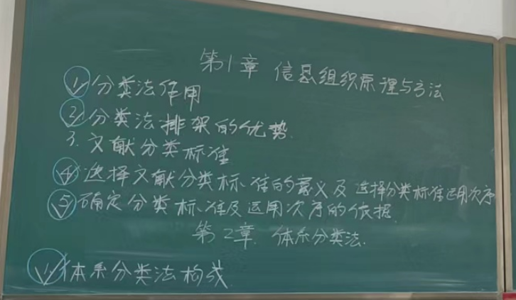
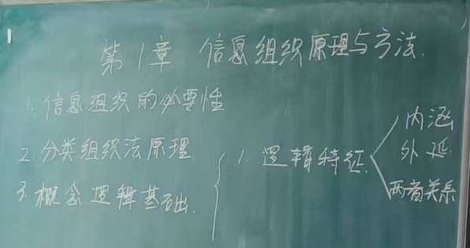
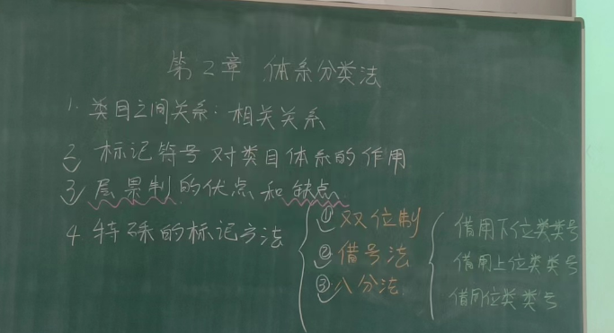
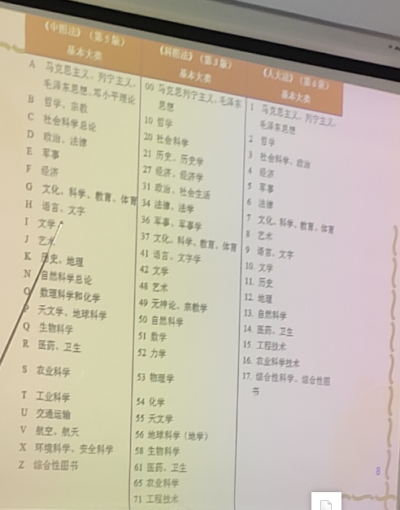

# 第一章：信息组织原理以及方法



1. 分类法的作用
`
一是建立分类检索与浏览系统

二是用于文献的分类排架
`
2. 分类法排架的优势
```
 * 在开架的情况下，适合读者触类旁通，按类索书
 * 有助于管理人员从学科专业的角度熟悉管藏
 * 有利于对馆藏进行分类统计
```

3. 选择文献分类标准的意义，及选择分类标准运用次序

```
能够将具有这种属性特征的文献加以集中，从而为用户提供从这种属性特征入手文献检索的途径
```
4. 确定分类标准及运用次序的意义
5. 体系分类法的构成
6. 逻辑特征中的内涵，外延，两者关系    
`
概念的内涵是概念质的方面，是指概念所反映的客观对象的本质属性，      
概念的外延是概念量的方面，是指概念所反映的具有同一内涵的客观对象的范围
内涵和外延是相互制约的

`

# 第二章：体系分类法
        

        


      

1. 主表
```
主表是体系分类法的主体，由基本部类，基本大类，简表和详表组成


```

```
类在文献分类法中称为类目，类目是构成分类法的基本单元，其中表示类目的名称叫做类名，类目的代号称为分类号
```


2. 体系分类法的构成

老师说要背的到H还抽查的


# 第六节课（4月3日）

# 第七节课


# 第8节课


# 第9节课

# 第10节课

# 第11 节课
